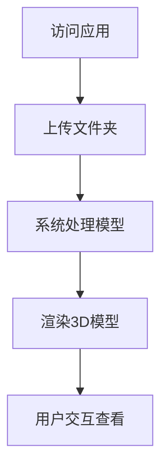

## 1. Product Overview
倾斜摄影3D模型查看器是一个基于Web的应用，用于上传和展示倾斜摄影生成的3D模型。
- 主要功能包括文件夹上传、3D模型渲染和交互查看，解决用户在网页中快速查看3D模型的需求。
- 目标用户为需要查看倾斜摄影数据的专业人士，如测绘、规划、建筑等领域的从业者。

## 2. Core Features

### 2.1 User Roles
| Role | Registration Method | Core Permissions |
|------|---------------------|------------------|
| Normal User | 无需注册 | 上传文件夹、查看3D模型 |

### 2.2 Feature Module
1. **首页**：上传区域、3D模型查看区域、操作控制面板

### 2.3 Page Details
| Page Name | Module Name | Feature description |
|-----------|-------------|---------------------|
| 首页 | 上传区域 | 支持文件夹上传，显示上传进度，支持拖拽上传 |
| 首页 | 3D模型查看区域 | 渲染3D模型，支持旋转、缩放、平移等交互操作 |
| 首页 | 操作控制面板 | 提供模型控制选项，如视角调整、图层控制等 |

## 3. Core Process
用户访问应用 → 上传包含3D模型的文件夹 → 系统处理并渲染模型 → 用户交互查看模型

## 4. User Interface Design
### 4.1 Design Style
- 主色调：深蓝色(#1a365d)和白色(#ffffff)，辅助色：浅蓝色(#63b3ed)
- 按钮样式：圆角矩形，有轻微的3D效果
- 字体：无衬线字体，主标题18px，正文14px
- 布局风格：简洁现代，顶部导航栏，中间为3D查看区域，底部为控制栏
- 图标风格：简约线条图标

### 4.2 Page Design Overview
| Page Name | Module Name | UI Elements |
|-----------|-------------|-------------|
| 首页 | 上传区域 | 拖拽上传区域，带有明显的上传按钮，上传进度条 |
| 首页 | 3D模型查看区域 | 占据页面主要区域的3D渲染画布，带有坐标轴指示器 |
| 首页 | 操作控制面板 | 位于页面右侧的可折叠控制面板，包含视角控制、模型属性等选项 |

### 4.3 Responsiveness
- 桌面优先设计，支持响应式布局
- 在移动设备上，控制面板将折叠为底部导航
- 支持触摸操作，可通过手势控制3D模型

### 4.4 3D Scene Guidance
- 环境：默认使用中性灰色背景，可切换为天空盒
- 光照：默认使用 directional light 和 ambient light 组合
- 相机：默认使用透视相机，支持轨道控制
- 交互：支持鼠标/触摸拖拽旋转，滚轮缩放，Shift+拖拽平移
- 后处理：添加轻微的抗锯齿效果
- 性能：针对大型模型进行优化，支持LOD (Level of Detail)