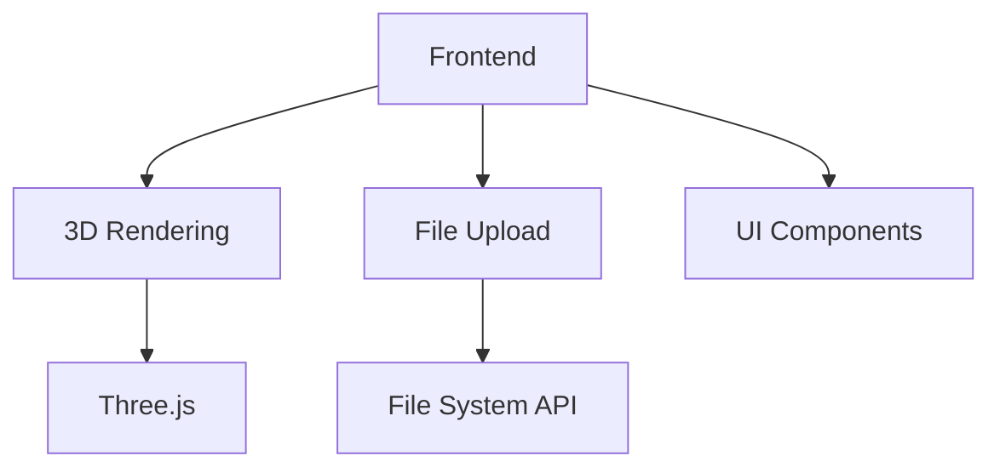

## 1. Architecture Design

## 2. Technology Description
- Frontend: React@18 + tailwindcss@3 + vite
- Initialization Tool: vite-init
- 3D Rendering: three.js + @react-three/fiber + @react-three/drei
- File Upload: HTML5 File System API + directory upload
- State Management: zustand
- UI Components: custom components + lucide-react icons

## 3. Route Definitions
| Route | Purpose |
|-------|---------|
| / | 首页，包含上传区域和3D模型查看区域 |

## 4. Data Flow
1. 用户上传文件夹 → 前端处理文件 → 解析3D模型数据 → 渲染到Three.js场景
2. 用户交互 → 触发相机/模型变换 → 更新Three.js场景

## 5. Component Structure
- App: 主应用组件
  - UploadArea: 文件夹上传组件
  - ModelViewer: 3D模型查看组件
    - ThreeScene: Three.js场景组件
    - Controls: 模型控制组件
  - ControlPanel: 操作控制面板

## 6. Technical Implementation Details
### 6.1 3D Rendering
- 使用 @react-three/fiber 作为React和Three.js的桥梁
- 使用 @react-three/drei 提供额外的3D组件和工具
- 支持GLTF/GLB格式的3D模型
- 实现基本的相机控制（旋转、缩放、平移）

### 6.2 File Upload
- 使用HTML5 File System API的directory upload功能
- 支持拖拽上传文件夹
- 显示上传进度和文件列表
- 处理文件读取和解析

### 6.3 Performance Optimization
- 使用WebGL加速3D渲染
- 实现模型的按需加载
- 优化大型模型的渲染性能
- 使用requestAnimationFrame进行流畅的动画

### 6.4 Responsiveness
- 使用tailwindcss实现响应式布局
- 针对不同设备优化交互方式
- 在移动设备上调整UI布局

### 6.5 Browser Compatibility
- 支持现代浏览器（Chrome, Firefox, Safari, Edge）
- 检测WebGL支持情况
- 提供降级方案（如不支持WebGL时显示提示）